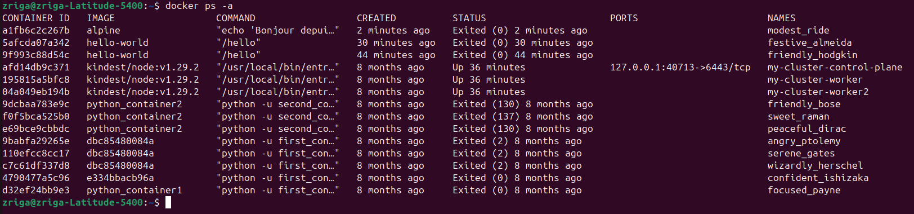
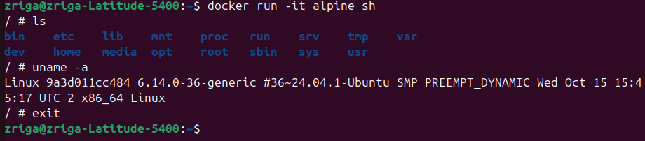

# Systèmes pour le machine learning
## Exercice 1: Installation de Docker et vérification de l’environnement
### Question 1-a

### Question 1-b

### Question 1-c

```
La commande docker ps -a affiche tous les conteneurs présents sur la machine, qu’ils soient :

- en cours d’exécution
- arrêtés
- terminés après une exécution

Pour chaque conteneur, Docker affiche :

- l’ID unique du conteneur
- l’image utilisée (ex : hello-world)
- son état (running, exited…)
- la date d’exécution
- un nom généré par Docker

Cette liste permet de voir tout l’historique des conteneurs lancés sur la machine.
```
---
## Exercice 2: Premiers pas avec Docker : images et conteneurs
### Question 2-a
```
Une image Docker est un modèle figé, une sorte de photo d’un environnement complet (système minimal, dépendances, application). Elle ne change jamais: c’est un fichier en lecture seule.

Un conteneur Docker, lui, est une instance vivante d’une image. C’est l’image exécutée, avec un processus en cours, un système de fichiers modifiable et une isolation du reste de la machine.
On peut créer plusieurs conteneurs à partir d’une même image.
```
### Question 2-b

```
Lorsque j’exécute cette commande, Docker :

télécharge l’image alpine si elle n’existe pas déjà
crée un conteneur temporaire
exécute la commande echo "Bonjour depuis un conteneur Alpine" à l’intérieur
affiche la sortie dans le terminal
arrête immédiatement le conteneur, car la commande a fini de s’exécuter.
```
### Question 2-c

```
Le conteneur Alpine apparaît avec le statut Exited car il a exécuté une seule commande (echo), puis il s’est arrêté immédiatement.
Un conteneur Docker ne reste actif que si un processus tourne en continu (par exemple un serveur).
Ici, la commande est terminée et donc le conteneur s'arrête automatiquement.
```
### Question 2-d

```
La commande ls montre un système de fichiers minimal : seulement quelques dossiers (bin, etc, usr, etc.).

La commande uname -a affiche des informations sur le noyau Linux.
On réalise que le conteneur utilise le noyau de la machine hôte, pas un noyau propre.

La commande exit ferme le shell et le conteneur s’arrête.
Docker revient au terminal de l’hôte.
```
---
## Exercice 3: Construire une première image Docker avec une mini-API FastAPI
### Question 3-a

### Question 3-b

### Question 3-c
---
## Exercice 4: Exécuter l’API FastAPI dans un conteneur Docker

---
## Exercice 5: Démarrer un mini-système multi-conteneurs avec Docker Compose

---
## Exercice 6: Interagir avec la base de données PostgreSQL dans un conteneur

---
## Exercice 7: Déboguer des conteneurs Docker : commandes essentielles et bonnes pratiques

---
## Exercice 8: Questions de réflexion et consignes pour le rendu