# Systèmes pour le machine learning
## Exercice 1: Installation de Docker et vérification de l’environnement
### Question 1-a

### Question 1-b

### Question 1-c

```
La commande docker ps -a affiche tous les conteneurs présents sur la machine, qu’ils soient :

- en cours d’exécution
- arrêtés
- terminés après une exécution

Pour chaque conteneur, Docker affiche :

- l’ID unique du conteneur
- l’image utilisée (ex : hello-world)
- son état (running, exited…)
- la date d’exécution
- un nom généré par Docker

Cette liste permet de voir tout l’historique des conteneurs lancés sur la machine.
```
---
## Exercice 2: Premiers pas avec Docker : images et conteneurs
### Question 2-a
```
Une image Docker est un modèle figé, une sorte de photo d’un environnement complet (système minimal, dépendances, application). Elle ne change jamais: c’est un fichier en lecture seule.

Un conteneur Docker, lui, est une instance vivante d’une image. C’est l’image exécutée, avec un processus en cours, un système de fichiers modifiable et une isolation du reste de la machine.
On peut créer plusieurs conteneurs à partir d’une même image.
```
### Question 2-b

```
Lorsque j’exécute cette commande, Docker :

télécharge l’image alpine si elle n’existe pas déjà
crée un conteneur temporaire
exécute la commande echo "Bonjour depuis un conteneur Alpine" à l’intérieur
affiche la sortie dans le terminal
arrête immédiatement le conteneur, car la commande a fini de s’exécuter.
```
### Question 2-c

```
Le conteneur Alpine apparaît avec le statut Exited car il a exécuté une seule commande (echo), puis il s’est arrêté immédiatement.
Un conteneur Docker ne reste actif que si un processus tourne en continu (par exemple un serveur).
Ici, la commande est terminée et donc le conteneur s'arrête automatiquement.
```
### Question 2-d

```
La commande ls montre un système de fichiers minimal : seulement quelques dossiers (bin, etc, usr, etc.).

La commande uname -a affiche des informations sur le noyau Linux.
On réalise que le conteneur utilise le noyau de la machine hôte, pas un noyau propre.

La commande exit ferme le shell et le conteneur s’arrête.
Docker revient au terminal de l’hôte.
```
---
## Exercice 3: Construire une première image Docker avec une mini-API FastAPI
### Question 3-c
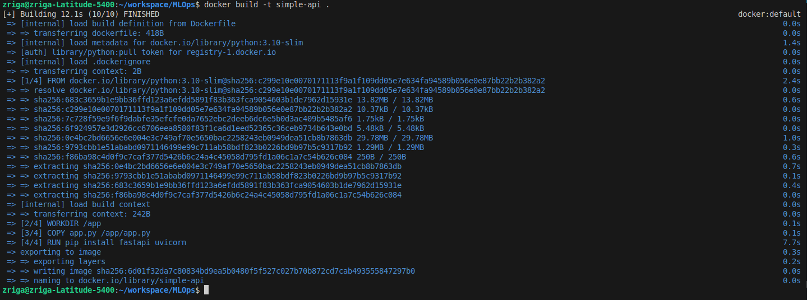
---
## Exercice 4: Exécuter l’API FastAPI dans un conteneur Docker
### Question 4-a
```
L’option: -p 8000:8000
signifie le port 8000 du conteneur (où tourne FastAPI) est mappé (connecté) au port 8000 de ma machine hôte.

Ça permet d’accéder à l’API FastAPI du conteneur via: http://localhost:8000

Sans ce mapping l'API tournerait dans Docker mais serait inaccessible depuis l’extérieur.
```
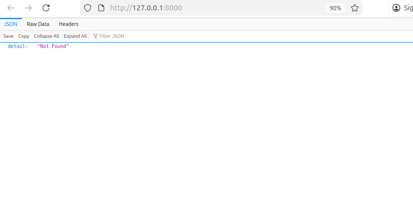
### Question 4-b

### Question 4-c
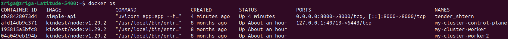
```
- Le nom du conteneur: tender_shtern
- L'image utilisée: simple-api
- Le port mappé: 0.0.0.0:8000->8000/tcp

```
### Question 4-d
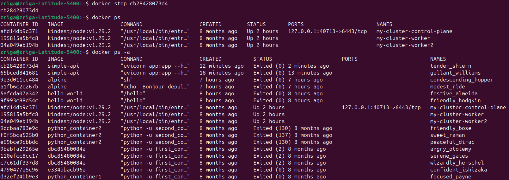
```
docker ps: affiche uniquement les conteneurs en cours d’exécution.

docker ps -a: affiche tous les conteneurs :
- en cours d’exécution
- arrêtés
- terminés

Donc :
Après un docker stop, le conteneur disparaît de docker ps, mais il reste visible dans docker ps -a avec le statut Exited.
```
---
## Exercice 5: Démarrer un mini-système multi-conteneurs avec Docker Compose
### Question 5-c
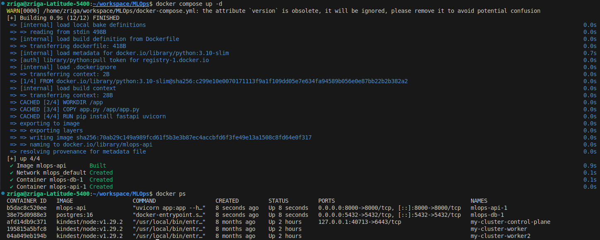
### Question 5-d
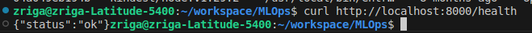
### Question 5-e
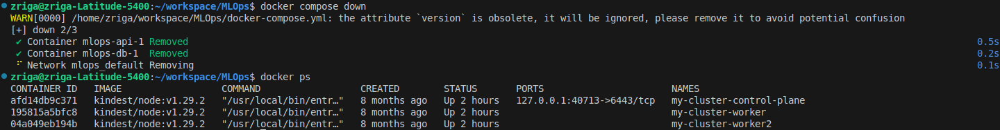
```
docker compose down:

    - Arrête tous les services définis dans docker-compose.yml
    - Supprime aussi les conteneurs créés par Compose
    - Supprime le réseau créé automatiquement
    - C’est une arrêt complet du système multi-conteneurs.

docker stop <id>

    - Arrête uniquement un conteneur spécifique
    - Ne supprime pas le conteneur
    - Ne supprime pas les réseaux ou volumes
    - C’est une action individuelle sur un conteneur.
```
---
## Exercice 6: Interagir avec la base de données PostgreSQL dans un conteneur
### Question 6-a

```
docker compose exec: exécute une commande à l’intérieur d’un conteneur géré par Docker Compose, sans l’arrêter ou le redémarrer.

db: nom du service défini dans docker-compose.yml (le conteneur PostgreSQL).

psql: programme client PostgreSQL qui permet d’exécuter des commandes SQL.

-U demo: option -U = User.
Cela indique l’utilisateur PostgreSQL à utiliser: demo.

-d demo: option -d = Database.
Cela spécifie le nom de la base à laquelle se connecter: demo.
```
### Question 6-b
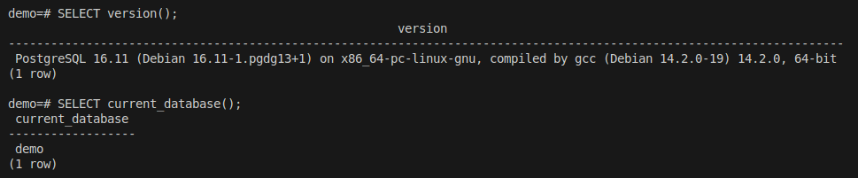
```
PostgreSQL version 16.11

La base actuellement utilisée est demo.
```
### Question 6-c
```
- Hostname à utiliser:

    Dans Docker Compose, chaque service possède un nom DNS automatique.
    Donc l’API peut se connecter à PostgreSQL via:

    hostname: db

- Port:

    À l’intérieur du réseau Docker:

    port: 5432

- Identifiants:

    Ceux définis dans docker-compose.yml:

    POSTGRES_USER: demo
    POSTGRES_PASSWORD: demo
    POSTGRES_DB: demo

    Donc:

    utilisateur: demo
    mot de passe: demo
    base: demo
```
### Question 6-d
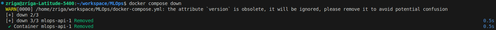
```
- Sans -v, Docker supprime uniquement les conteneurs et le réseau.
Les données PostgreSQL sont conservées (volumes persistants).

- Avec -v, Docker supprime aussi les volumes associés aux services.
Cela efface toutes les données stockées par PostgreSQL.
La base est remise à zéro comme si elle n’avait jamais existé.
```
---
## Exercice 7: Déboguer des conteneurs Docker : commandes essentielles et bonnes pratiques
### Question 7-a
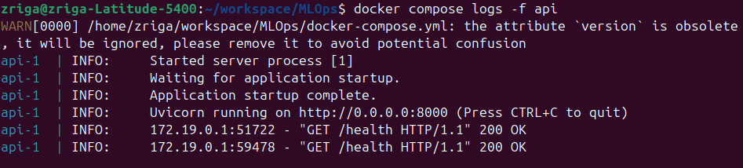
### Question 7-b
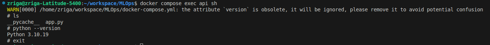
```
- ls: montre le contenu du dossier /app dans le conteneur: app.py


- python --version: affiche la version de Python installée dans l’image: Python 3.10.19

- exit: me fait sortir du conteneur.
```
### Question 7-c
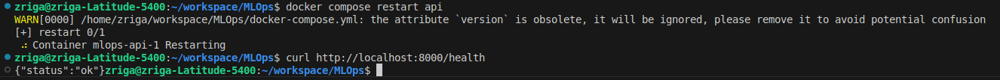
```
Un redémarrage est utile lorsque :

    - on change du code Python mais le conteneur utilise encore l’ancienne version.

    - l’API plante après une erreur temporaire.

    - la connexion à la base de données échoue au premier démarrage.

    - une nouvelle configuration d’environnement a été ajoutée.

Redémarrer permet de repartir proprement sans reconstruire l’image.
```
### Question 7-d
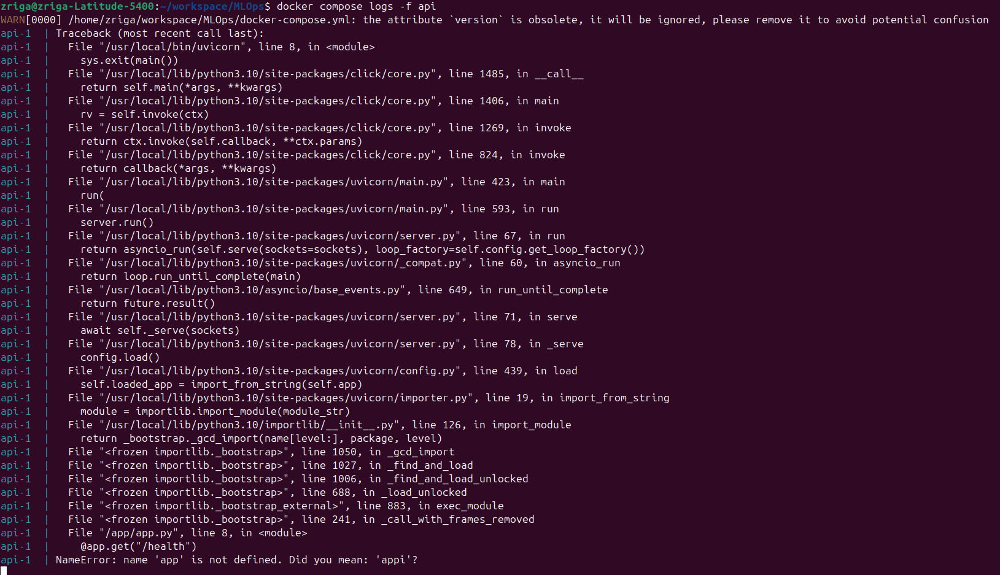
```
En consultant les logs avec: docker compose logs -f api

J’ai observé une erreur: NameError: name 'app' is not defined. Did you mean: 'appi'?

Cela indique que FastAPI essaie de charger un objet app, mais il ne le trouve pas dans app.py.

Le Dockerfile lance l’application avec: CMD ["uvicorn", "app:app", ...]

Donc Uvicorn s’attend à trouver une variable app dans le module app.py.
Comme je l’avais volontairement renommée en appi, l’API ne peut plus démarrer et le conteneur plante.
```
### Question 7-e
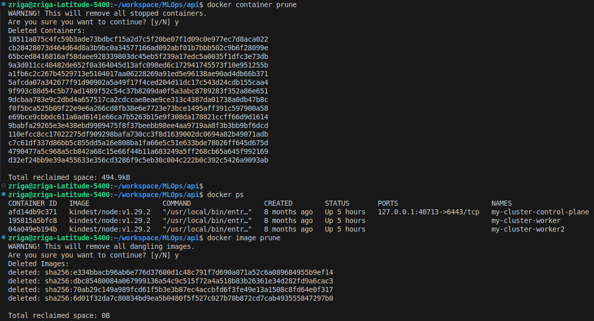
```
- Les conteneurs arrêtés s’accumulent et saturent le système.

- Les images inutilisées occupent plusieurs Go de stockage.

- Garder un environnement propre évite des conflits lors des builds.

Et donc pruner régulièrement empêche que Docker devienne lent ou plein.
```
---
## Exercice 8: Questions de réflexion et consignes pour le rendu
### Question 8-a
```
Un notebook Jupyter n’est pas adapté pour la production car il ne garantit pas la reproductibilité: on peut exécuter les cellules dans n’importe quel ordre, et comme expliqué dans le cours, cela crée des “états cachés non reproductibles”.
En plus, un notebook dépend de l’environnement local, ce qui va à l’opposé du besoin d’un environnement contrôlé et isolé.
Enfin, ce n’est pas un outil prévu pour être automatisé, testé ou monitoré, ce qui est indispensable pour un vrai système ML en production.

En bref, les notebooks sont parfaits pour de l'exploration ou des prototypes, mais pas pour la mise en production.
```
### Question 8-b
```
Docker Compose est essentiel car il permet de lancer plusieurs services (API, base de données…) comme un seul système cohérent, ce qui correspond exactement à l’architecture ML vue dans le cours.
Il gère automatiquement le réseau, les dépendances (depends_on), la configuration des ports et la reproductibilité de l’environnement. Pendant le TP, il m’a permis de démarrer une API + PostgreSQL avec une seule commande, ce qui serait compliqué et source d’erreurs sans Compose.
```