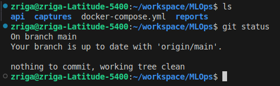
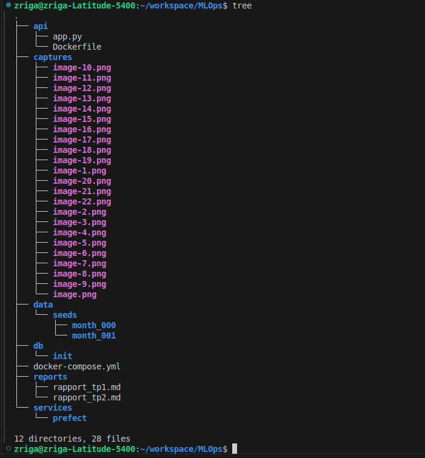
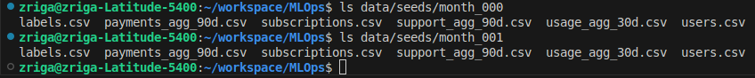
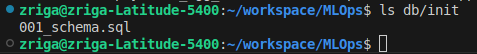
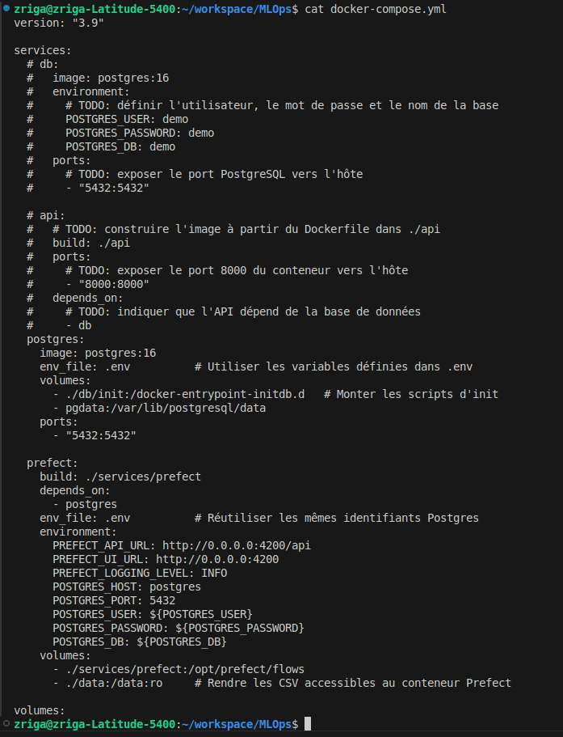
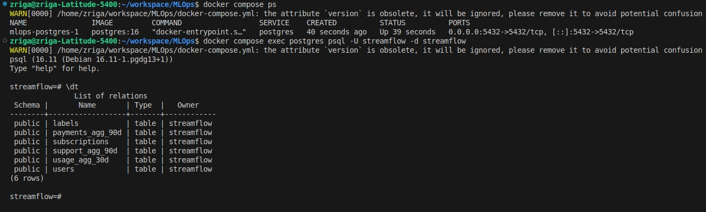
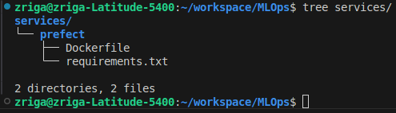
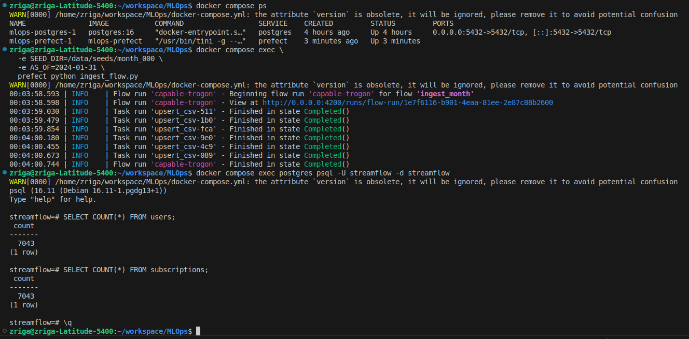
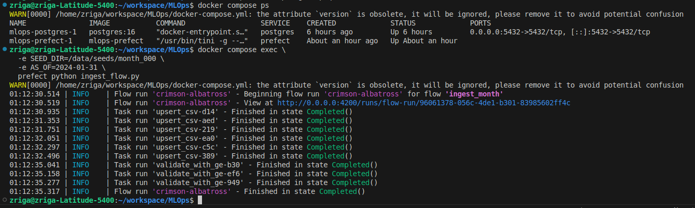

# Systèmes pour le machine learning - CI2 : Ingestion mensuelle, validation et snapshots
## Exercice 1: Mise en place du projet et du rapport
### Question 1-a
#### État initial du dépôt

### Question 1-b

### Question 1-c
#### Structure des données

---
## Exercice 2: Base de données et docker-compose
### Question 2-a

### Question 2-b
```
Le fichier `.env` permet de stocker les variables d’environnement utilisées par les conteneurs Docker, comme les identifiants de la base de données PostgreSQL.  
Il permet de séparer la configuration du code et d’éviter de coder en dur des informations sensibles.
```
### Question 2-c

### Question 2-d

```
users : informations de base sur les utilisateurs.

subscriptions : données liées aux abonnements et aux options souscrites.

usage_agg_30d : statistiques d’usage agrégées sur 30 jours.

payments_agg_90d : informations sur les paiements échoués sur 90 jours.

support_agg_90d : données liées aux tickets de support sur 90 jours.

labels : étiquettes de churn utilisées pour l’entraînement du modèle.
```
---
## Exercice 3: Upsert des CSV avec Prefect (month_000)
### Question 3-a

```
Le conteneur Prefect est utilisé pour orchestrer le pipeline d’ingestion des données.  
Il permet d’exécuter des flows, de gérer les dépendances entre les tâches et de piloter les différentes étapes du pipeline (ingestion, validation, snapshots).
```
### Question 3-b
```
La fonction `upsert_csv` lit un fichier CSV dans un DataFrame pandas, crée une table temporaire PostgreSQL, puis insère les données dans la table cible en utilisant une stratégie d’upsert.  
En cas de conflit sur la clé primaire, les colonnes non clés sont mises à jour avec les nouvelles valeurs provenant du CSV.
```
### Question 3-c

```
Après l’ingestion des données du mois 000, la base de données PostgreSQL contient 7 043 clients, correspondant au nombre total d’utilisateurs présents dans les tables users et subscriptions
```
---
## Exercice 4: Validation des données avec Great Expectations 
### Question 4-a
```
La fonction validate_with_ge permet de vérifier la qualité et la cohérence des données après leur ingestion en appliquant des règles de validation avec Great Expectations. En cas de données invalides, le flow Prefect échoue afin d’empêcher la propagation d’erreurs vers les étapes suivantes du pipeline.
```
### Question 4-b

### Question 4-c
#### Validation des données
```python
gdf.expect_column_values_to_be_between("watch_hours_30d", min_value=0)
gdf.expect_column_values_to_be_between("avg_session_mins_7d", min_value=0)

Ces bornes ont été choisies car des valeurs négatives pour le temps de visionnage ou la durée moyenne de session sont physiquement impossibles et indiqueraient une erreur dans les données ou dans le processus d’export.

Ces règles de validation protègent le futur modèle de machine learning en empêchant l’ingestion de données incohérentes ou corrompues.
Elles permettent de détecter rapidement des anomalies en amont du pipeline, évitant ainsi d’entraîner un modèle sur des données incorrectes et de dégrader ses performances.
```
---
## Exercice 5: Snapshots et ingestion month_001
### Question 5-a
### Question 5-b
### Question 5-c