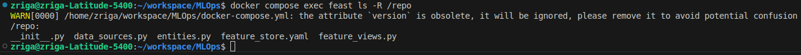
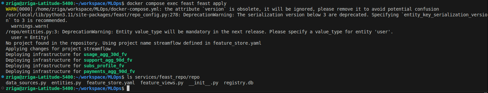
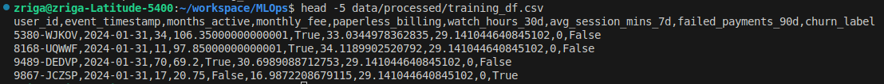
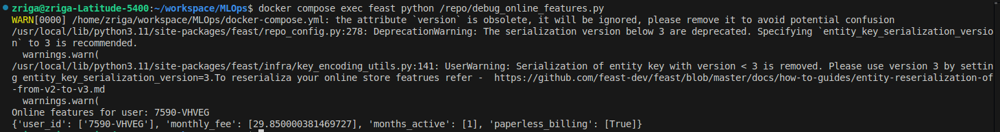
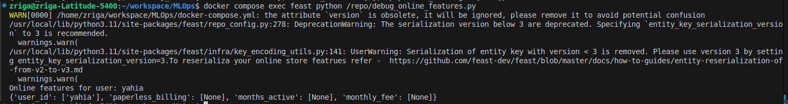
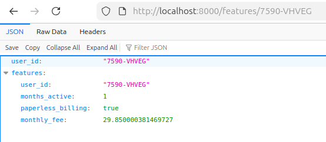

# Systèmes pour le machine learning - CI3 : Introduction à Feast et au Feature Store pour StreamFlow
## Contexte
```
À l’issue des TP précédents, nous disposons d’un pipeline d’ingestion de données complet pour le projet StreamFlow. Les données issues de fichiers CSV mensuels sont ingérées dans PostgreSQL, validées avec Great Expectations et historisées à l’aide de snapshots temporels pour deux périodes distinctes (month_000 et month_001). Ces données couvrent les utilisateurs, les abonnements, l’usage, les paiements et le support.

L’objectif du TP3 est de connecter ce pipeline existant à un Feature Store à l’aide de Feast. Il s’agit de définir les entités et les features, de récupérer des données en mode offline pour l’entraînement futur d’un modèle de churn, puis d’exposer ces features en mode online afin de les rendre accessibles via une API.
```
## Mise en place de Feast
Les services ont été construits et démarrés à l’aide de la commande suivante :
```bash
docker compose up -d --build
```
Le conteneur Feast est dédié à la gestion du Feature Store. La configuration du Feature Store se trouve dans le dossier /repo à l’intérieur du conteneur, notamment dans le fichier feature_store.yaml. Ce dossier est monté depuis le répertoire services/feast_repo/repo du projet.

Le conteneur Feast sera utilisé via la commande docker compose exec feast afin de lancer les commandes Feast, comme feast apply pour appliquer la configuration ou feast materialize pour matérialiser les features dans l’online store.


## Définition du Feature Store
```
Une Entity dans Feast représente un objet métier central sur lequel les features sont calculées et jointes. Dans le projet StreamFlow, l’entité principale est l’utilisateur.

La colonne `user_id` est un bon choix de clé de jointure car elle identifie de manière unique chaque client et est déjà utilisée comme clé principale dans toutes les tables PostgreSQL (users, subscriptions et tables de snapshots).
```
```
Les DataSources Feast sont définies à partir des tables de snapshots PostgreSQL. Par exemple, la table `usage_agg_30d_snapshots` contient des features comme `watch_hours_30d`, `avg_session_mins_7d`, `unique_devices_30d` et `skips_7d`, associées à chaque utilisateur et horodatées par le champ `as_of`.
```
```
Les FeatureViews permettent de regrouper les features par entité et par source de données. La commande `feast apply` sert à enregistrer la configuration du Feature Store (entités, sources et FeatureViews) dans le registre Feast. Ce registre est utilisé par Feast pour savoir quelles features sont disponibles et comment les récupérer en mode offline et online.
```

## Récupération offline & online
La récupération offline des features a été réalisée à l’aide de la commande suivante :
```bash
docker compose exec prefect python build_training_dataset.py
```

```
Feast garantit la cohérence temporelle (point-in-time correctness) grâce au champ `timestamp_field = "as_of"` défini dans les DataSources. Lors de la récupération offline, Feast ne joint que les features dont le timestamp est antérieur ou égal à la date `event_timestamp` fournie dans le `entity_df`.

La structure du `entity_df`, contenant `user_id` et `event_timestamp`, permet ainsi d’éviter toute fuite d’information future (data leakage) et d’assurer que les features utilisées pour l’entraînement correspondent bien à l’état des données à la date considérée.
```

```
Si un user_id n’existe pas dans l’Online Store ou s’il n’a pas été matérialisé dans la fenêtre temporelle demandée, Feast retourne des valeurs nulles (None), indiquant que les features ne sont pas disponibles pour cette entité.
Par exemple:
```




## Réflexion
```
L’endpoint /features/{user_id} réduit le training-serving skew car il interroge directement Feast, qui centralise la définition et le calcul des features. Les mêmes FeatureViews sont utilisées pour construire le dataset d’entraînement offline et pour servir les features en production, garantissant ainsi une cohérence totale entre entraînement et inférence.
```

```
Le dépôt Git a été tagué avec tp3.
```