# Systèmes pour le machine learning - CI4 : Entraînement end-to-end : MLflow Registry → API de prédiction<
## Exercice 1: Mise en route + rappel de contexte (sanity checks + où on en est dans la pipeline)
```bash
docker compose up -d --build
docker compose ps
curl -s http://localhost:8000/health
curl -I http://localhost:5000 | head -n 1
curl -s http://localhost:8000/features/7590-VHVEG
```
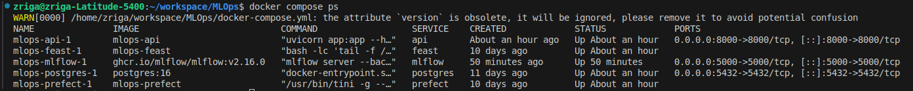
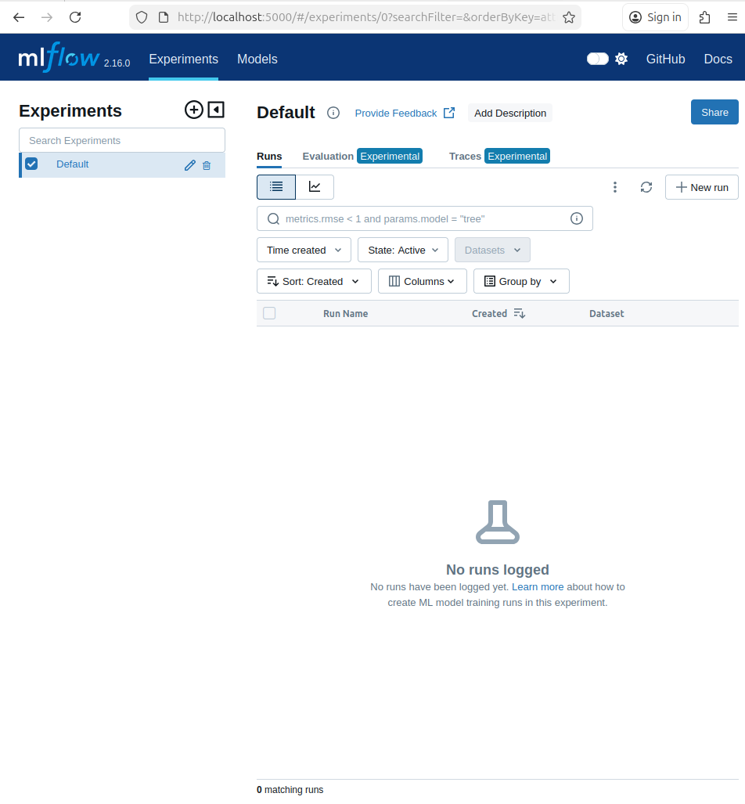
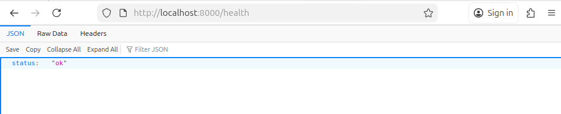
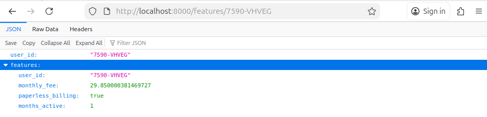
```
PostgreSQL stocke les tables live issues de l’ingestion, les tables de snapshots temporels, et sert également d’offline store et d’online store pour Feast.

Prefect orchestre les pipelines de données : ingestion des CSV, validation avec Great Expectations, création des snapshots et construction du dataset d’entraînement. Il garantit une exécution reproductible et observable des étapes de data engineering.

Feast fournit un Feature Store unifié, permettant de définir les features à partir des snapshots et de les récupérer de manière cohérente en mode offline (entraînement) et online (serving), ce qui limite le training-serving skew.

MLflow assure le suivi des entraînements de modèles (paramètres, métriques, artefacts) et le registre de modèles, permettant de promouvoir un modèle en Production de manière contrôlée.

L’API FastAPI expose des endpoints simples (/health, /features/{user_id}) et servira ensuite le modèle de prédiction en s’appuyant sur les features fournies par Feast et le modèle validé dans MLflow.
```
---
## Exercice 2: Créer un script d’entraînement + tracking MLflow (baseline RandomForest)
```
on met pipe, pas clf, car sinon on perds le preprocessing (OneHot etc.).
```
```
- AS_OF = 2024-01-31

- Nombre de lignes du dataset après merge = 7043

- Colonnes catégorielles détectées (cat_cols) = ['plan_stream_tv', 'plan_stream_movies', 'net_service']

- Métriques:
    AUC = 0.6414
    F1 = 0.0970
    ACC = 0.7570
    Temps d’entraînement = 0.9528 s
```
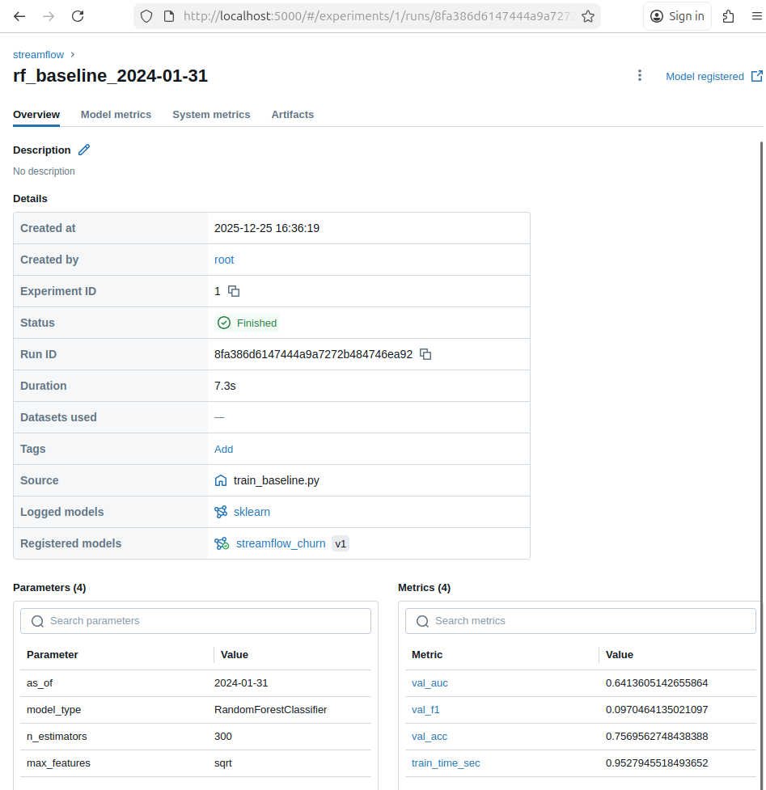
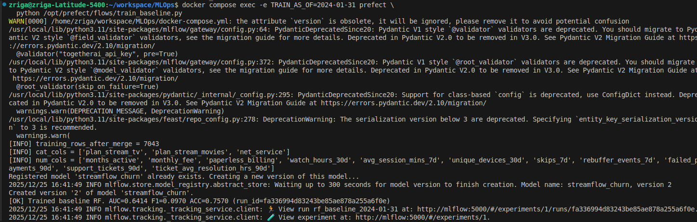
```
La variable `AS_OF` permet de figer le contexte temporel des données utilisées pour l’entraînement.
En l’imposant explicitement, on garantit que les features récupérées via Feast correspondent exactement à l’état des snapshots à une date donnée, évitant toute fuite d’information future (data leakage) et permettant de rejouer l’entraînement à l’identique.

Le paramètre `random_state` est fixé afin de rendre déterministes les étapes stochastiques du pipeline, comme le découpage train/validation et l’apprentissage du modèle RandomForest.
Cela garantit que deux exécutions avec les mêmes données produisent les mêmes résultats, ce qui est essentiel pour comparer des modèles, auditer un entraînement et assurer la traçabilité dans un système MLOps orienté production.
```
---
## Exercice 3: Explorer l’interface MLflow et promouvoir un modèle
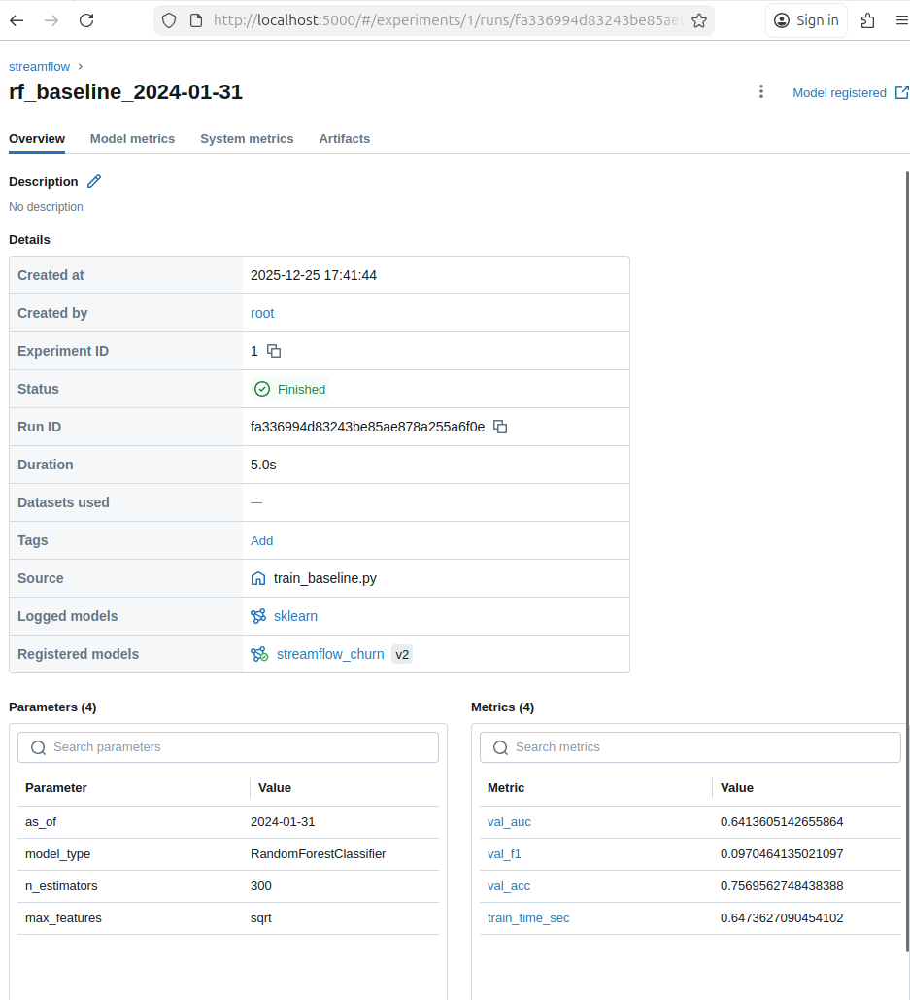
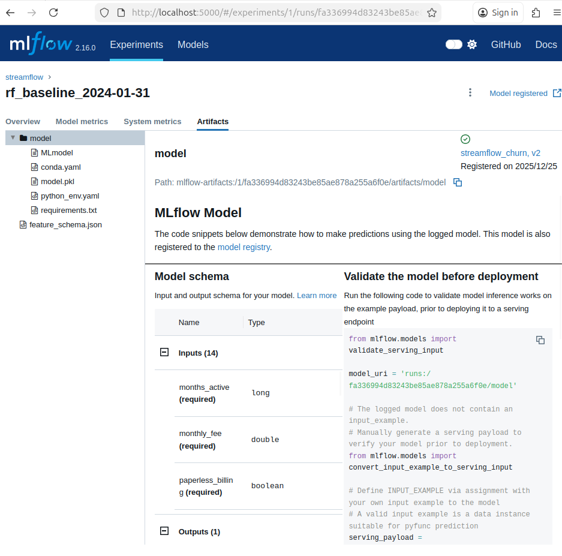
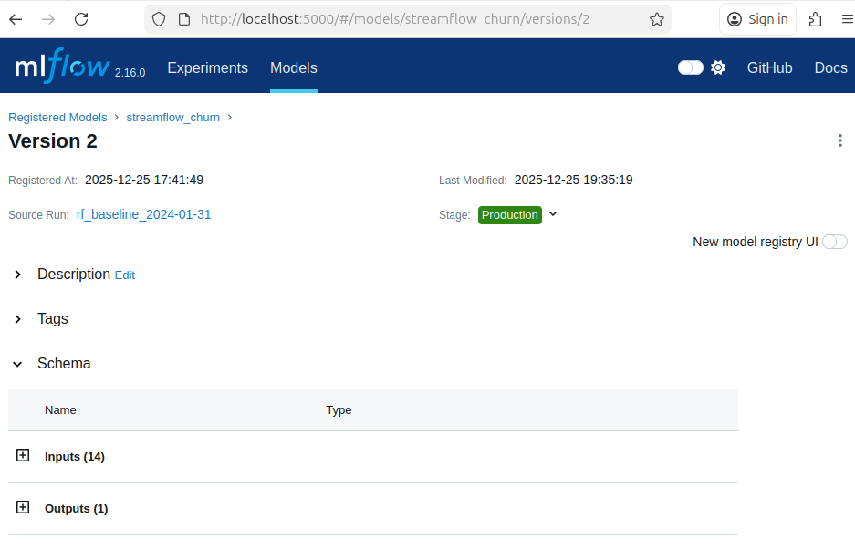
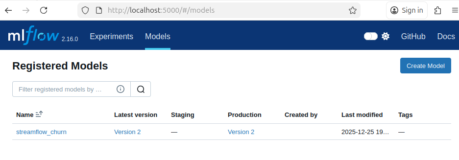
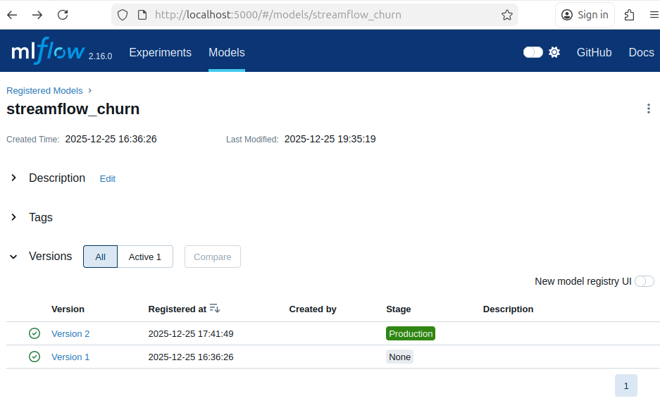
```
La promotion via le Model Registry (stages None/Staging/Production) permet de piloter le cycle de vie d’un modèle de façon contrôlée, traçable et reproductible. 
On ne déploie pas “un fichier local”, mais une version liée à un run MLflow, avec ses paramètres, métriques et artefacts, ce qui facilite l’audit et le rollback.
Le stage “Production” devient une référence stable pour le serving : l’API peut charger automatiquement “le modèle en Production” sans dépendre d’un chemin ou d’un fichier spécifique.
Cela réduit les erreurs humaines (mauvais fichier, mauvaise version, oubli de dépendances) et permet de standardiser la validation (passage Staging → Production).
Enfin, l’interface centralise l’historique des versions et rend la gouvernance plus simple (qui a promu quoi, quand, et pourquoi).
```
---
## Exercice 4: Étendre l’API pour exposer /predict (serving minimal end-to-end)
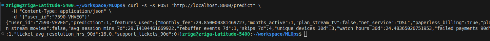
```
L’API charge le modèle via l’URI `models:/streamflow_churn/Production` afin de découpler le code de serving de toute dépendance à un fichier local ou à un run spécifique.
Le Model Registry MLflow fournit une référence stable vers la version du modèle validée pour la production, indépendamment de son emplacement physique ou de son run d’origine.

Ce mécanisme permet de changer de modèle (rollback ou nouvelle version) sans modifier le code de l’API, simplement en mettant à jour le stage dans l’interface MLflow.
Il améliore la traçabilité, la gouvernance et réduit fortement les risques d’erreurs liées à des chemins locaux ou à des artefacts obsolètes.
```
---
## Exercice 5: Robustesse du serving : cas d’échec réalistes (sans monitoring)
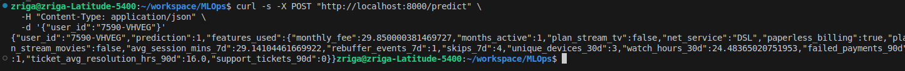
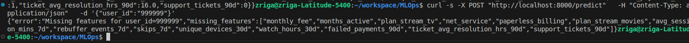
```
En serving, de nombreuses erreurs proviennent non pas du modèle mais des features.
Un premier cas fréquent est celui d’une entité absente : le user_id demandé n’existe pas dans l’online store Feast, ce qui se traduit par des valeurs nulles pour toutes les features.
Sans garde-fou, le modèle produirait alors une prédiction incohérente.

Un second cas est celui d’un online store incomplet ou obsolète, par exemple si la matérialisation des features n’a pas été exécutée ou est trop ancienne. Là encore, des valeurs manquantes apparaissent côté API.

La détection précoce de ces situations (via un contrôle explicite des valeurs nulles) permet de renvoyer une erreur claire, d’éviter des prédictions invalides et de protéger le système en production avant même d’introduire des mécanismes de monitoring avancés.
```
---
## Exercice 6: Réflexion de synthèse (ingénierie MLOps)

### 6-a — Ce que garantit MLflow dans cette pipeline

MLflow garantit la traçabilité complète des entraînements en associant chaque modèle à un run identifié de manière unique (run_id), contenant les paramètres utilisés (AS_OF, hyperparamètres), les métriques calculées (AUC, F1, accuracy, temps d’entraînement) et les artefacts produits (modèle sérialisé, schéma des features). Cela permet de rejouer, comparer ou auditer un entraînement a posteriori.

Au niveau de l’identification des modèles servis, MLflow fournit un Model Registry qui versionne explicitement chaque modèle enregistré. Le modèle servi n’est pas un fichier arbitraire, mais une version précise (`streamflow_churn` Version 2 par exemple), liée à un run traçable et à un état du pipeline d’entraînement clairement identifié.

---

### 6-b — Signification concrète du stage Production pour l’API

Le stage `Production` désigne explicitement la version du modèle considérée comme valide pour le serving. Au démarrage, l’API charge le modèle via l’URI
`models:/streamflow_churn/Production`, ce qui signifie qu’elle récupère automatiquement la version actuellement promue en Production dans le Model Registry.

Cela permet de changer de modèle en production sans modifier le code de l’API ni redéployer manuellement un artefact : une simple transition de stage dans l’interface MLflow suffit.
À l’inverse, cela empêche l’API de charger par erreur une version non validée (staging, archived) ou un fichier local obsolète, ce qui renforce la gouvernance et la sécurité du déploiement.

---

### 6-c — Points où la reproductibilité peut encore casser

Premièrement, les données peuvent évoluer : si les snapshots Feast ou la table labels changent ou sont recalculés différemment, un entraînement avec le même code et le même AS_OF peut produire un dataset différent.

Deuxièmement, le code peut évoluer sans être versionné strictement (changements dans le pipeline de features, preprocessing, logique de merge ou hyperparamètres), ce qui casserait la reproductibilité si le commit exact n’est pas associé au run MLflow.

Enfin, l’environnement d’exécution peut diverger : versions de librairies Python, images Docker, ou paramètres de configuration (variables d’environnement, seed non fixée dans certaines parties) peuvent modifier subtilement le comportement du modèle, même si MLflow est utilisé pour le tracking.

