# Systèmes pour le machine learning - CI5 : Monitoring et observabilité
## Exercice 1: Démarrer la stack pour l'observabilité
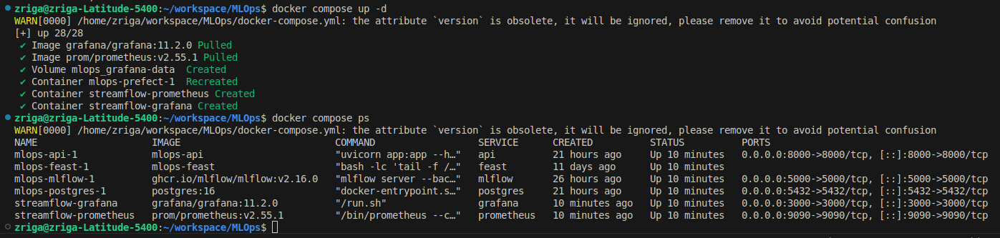
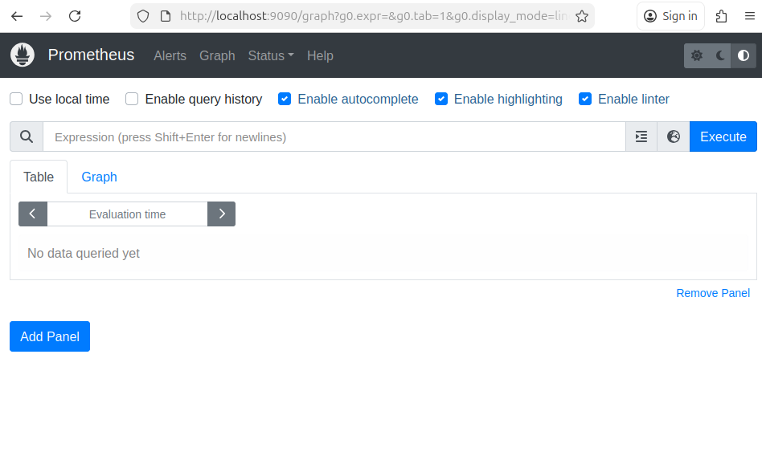
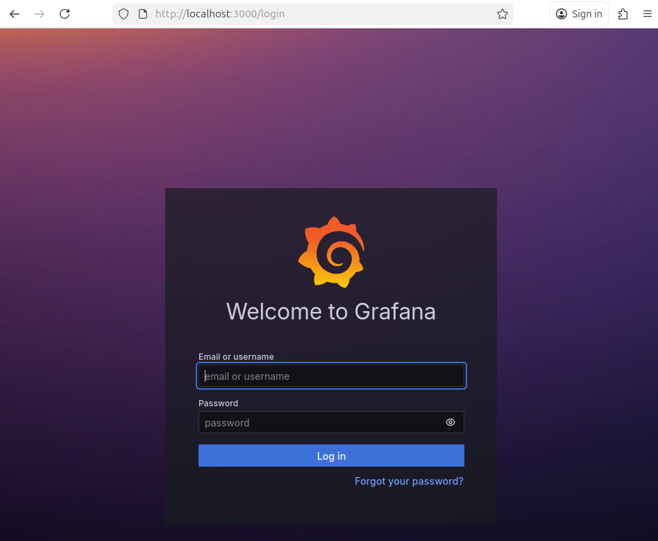
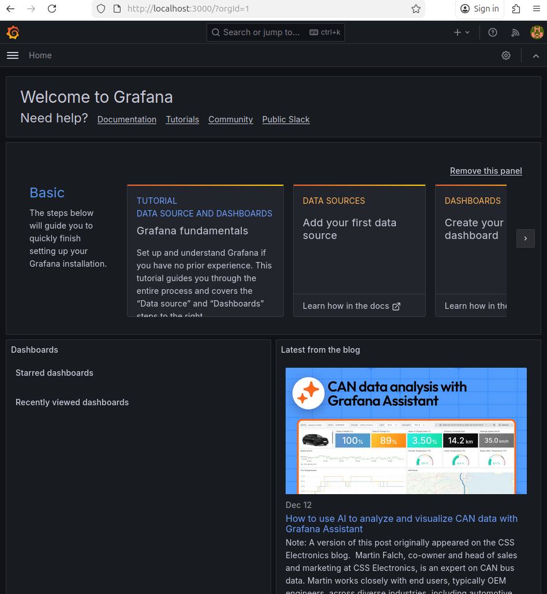
```
Prometheus tourne dans un conteneur Docker : depuis ce conteneur, localhost désigne le conteneur Prometheus lui-même, pas la machine hôte. Dans le réseau Docker Compose, les services communiquent via le nom du service (DNS interne), donc Prometheus doit cibler l’API via api:8000.
```
---
## Exercice 2: Instrumentation de FastAPI avec de métriques Prometheus
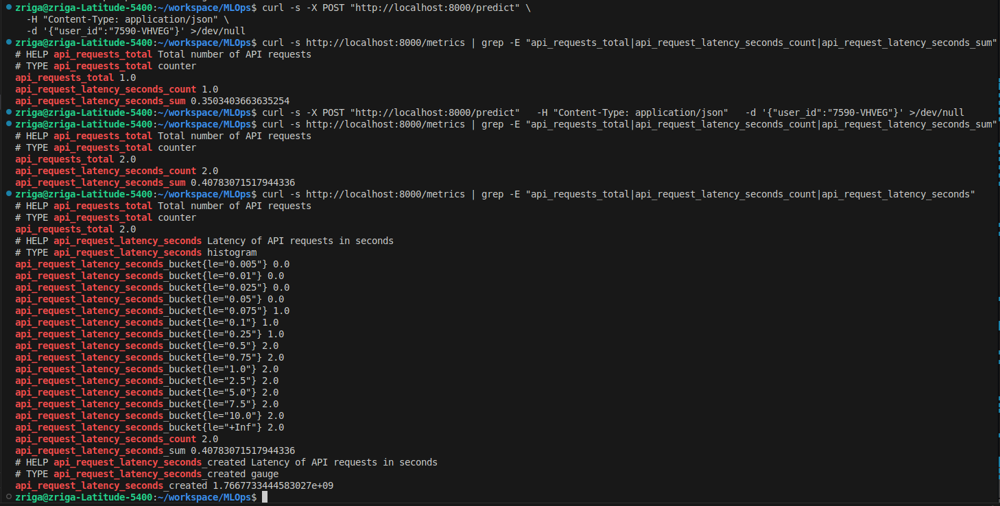
### Pourquoi un histogramme est plus utile qu’une simple moyenne de latence
Une moyenne de latence peut masquer les requêtes lentes : si 95% des requêtes sont rapides mais 5% très lentes, la moyenne reste “correcte” alors que l’expérience utilisateur se dégrade.
Un histogramme enregistre une distribution (buckets) et permet d’estimer des percentiles (p95/p99), donc d’observer la tail latency. C’est essentiel en production car ce sont souvent les requêtes extrêmes (lentes/timeout) qui provoquent les incidents.
---
## Exercice 3: Exploration de Prometheus (Targets, Scrapes, PromQL)
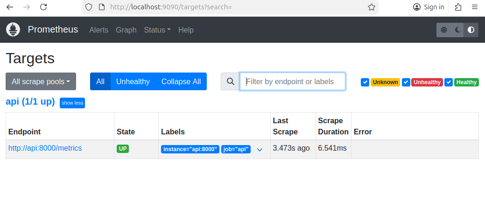
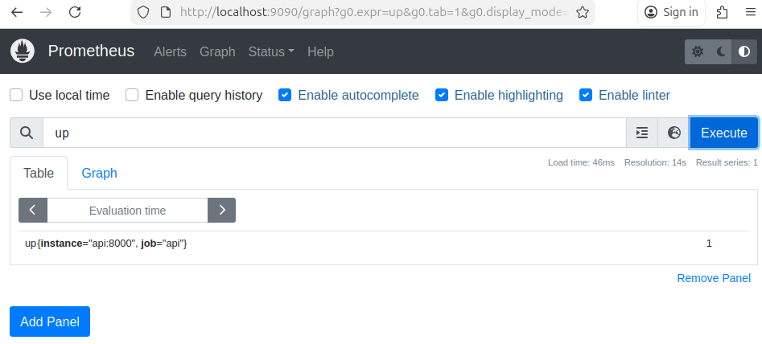
```
up: indique si une cible Prometheus est joignable.
Une valeur à 1 signifie que l’API est bien accessible et scrappée par Prometheus.
```
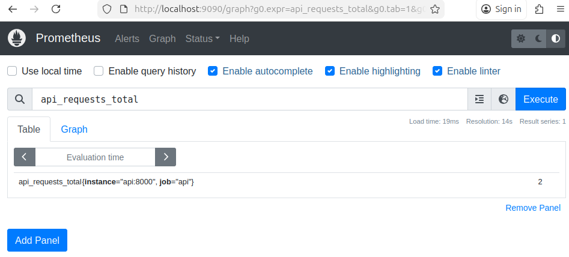
```
api_requests_total: c’est le nombre total de requêtes reçues par l’API depuis son démarrage.
```
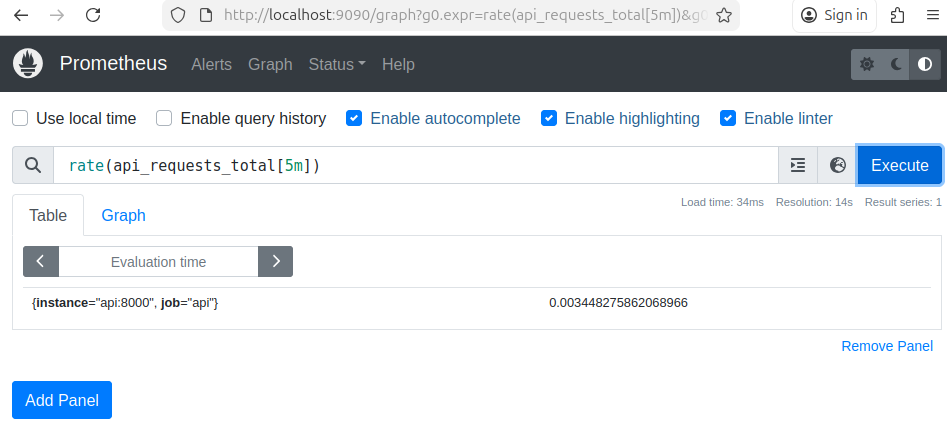
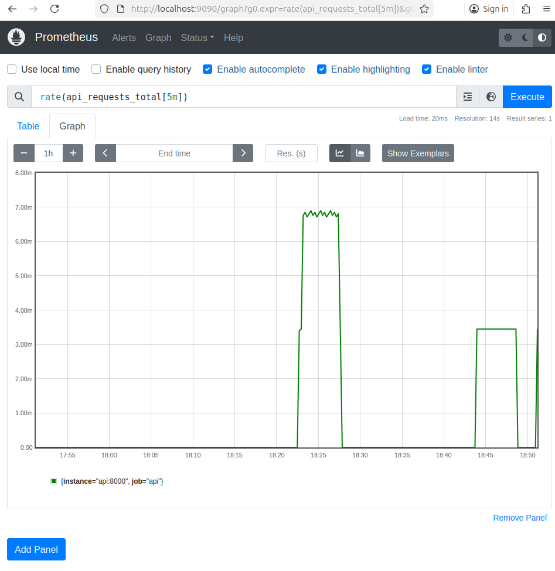
```
rate(api_requests_total[5m]): c’est le débit moyen de requêtes par seconde sur les 5 dernières minutes.
```
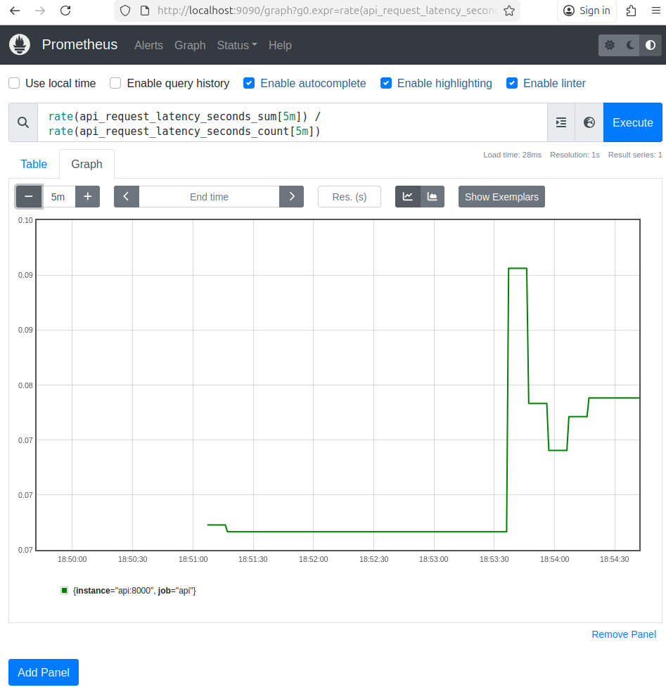
```
rate(api_request_latency_seconds_sum[5m]) / rate(api_request_latency_seconds_count[5m]): cette valeur représente la latence moyenne des requêtes API sur les 5 dernières minutes.
```
---
## Exercice 4: Setup de Grafana Setup et création d'un dashboard minimal
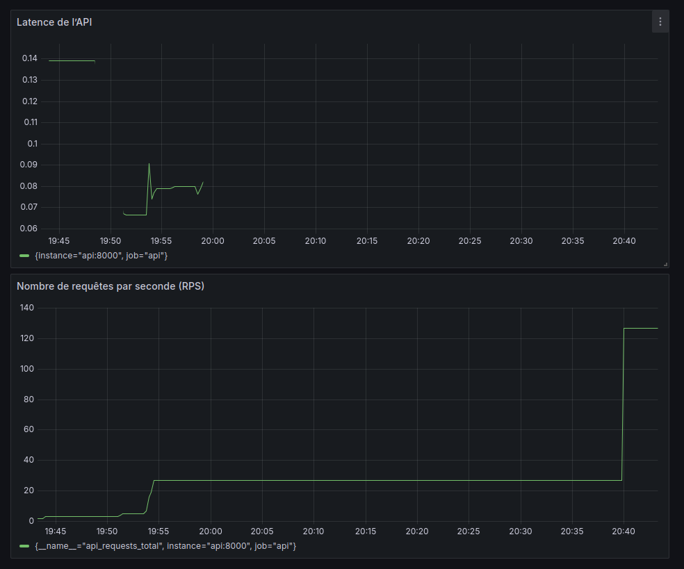
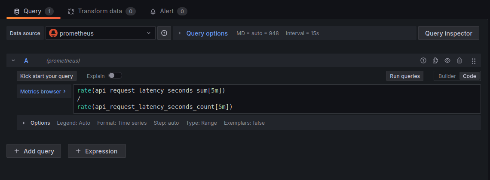
```
Le dashboard Grafana permet de visualiser le trafic et la latence de l’API en temps réel.
Le panel RPS détecte immédiatement une hausse du nombre de requêtes, tandis que le panel de latence met en évidence l’impact du trafic sur les temps de réponse.

Ces métriques permettent de détecter des problèmes de charge, de performance ou d’indisponibilité du service. En revanche, elles ne donnent aucune information sur la qualité du modèle (précision, dérive des données ou erreurs de prédiction), ce qui nécessite des métriques et outils complémentaires côté machine learning.
```
---
## Exercice 5: Drift Detection with Evidently (Month_000 vs Month_001)
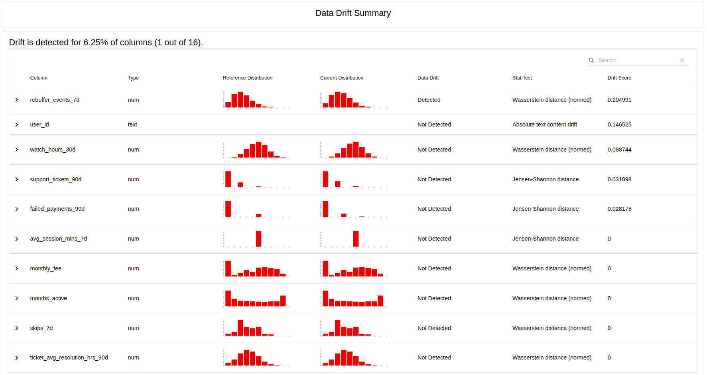


**Covariate drift:** drift sur les variables d’entrée (features) : la distribution des comportements/abonnements change entre deux mois.  
**Target drift:** drift sur la cible `churn_label` : la proportion de churn (ou sa distribution) change entre deux mois.

**Décision finale imprimée par le script:**
[Evidently] report_html=/reports/evidently/drift_2024-01-31_vs_2024-02-29.html report_json=/reports/evidently/drift_2024-01-31_vs_2024-02-29.json drift_share=0.06 -> NO_ACTION drift_share=0.06 < 0.30 (target_drift=0.0)
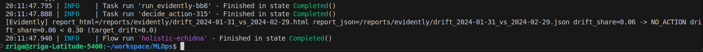
