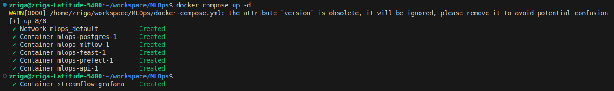
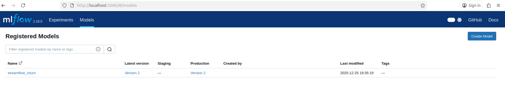
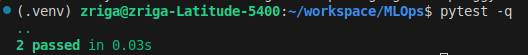
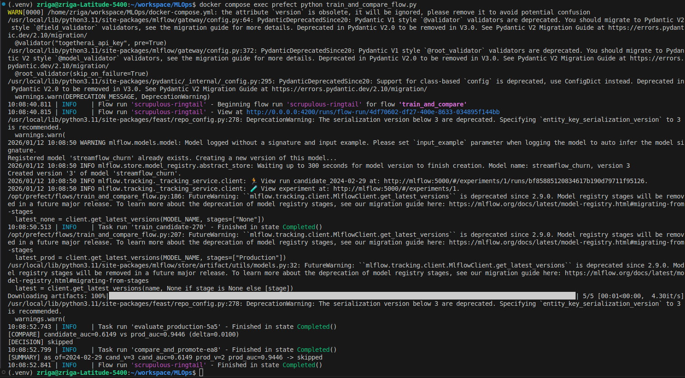
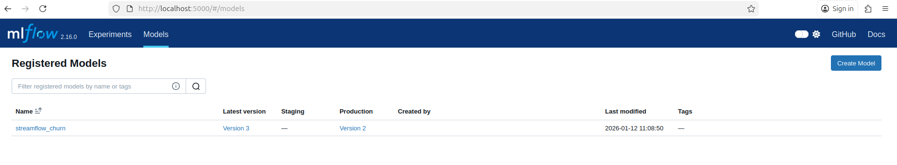
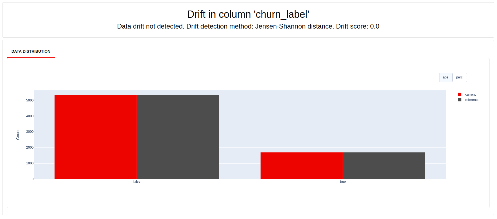
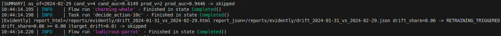

# Systèmes pour le machine learning - CI6 : CI/CD pour systèmes ML + réentraînement automatisé + promotion MLflow
## Exercice 1: Mise en place du rapport et vérifications de départ



---
## Exercice 2: Ajouter une logique de décision testable (unit test)

```
On extrait une fonction pure pour tester la logique de décision indépendamment de Prefect/MLflow, ce qui rend les tests unitaires rapides, déterministes et faciles à débugger.
```
---
## Exercice 3: Créer le flow Prefect train_and_compare_flow (train → eval → compare → promote)


```
On utilise un delta pour éviter de promouvoir un modèle pour une amélioration trop faible (souvent due au hasard du split, au bruit ou à la variance du modèle). Cela agit comme un garde-fou : promotion seulement si le gain est significatif et reproductible.
```
---
## Exercice 4: Connecter drift → retraining automatique (monitor_flow.py)


---
## Exercice 5: Redémarrage API pour charger le nouveau modèle Production + test /predict
